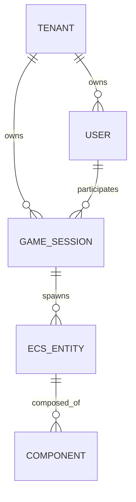
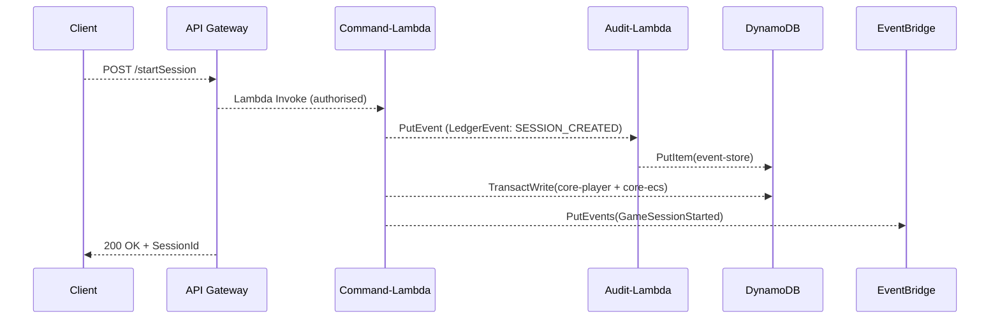

```markdown
# LedgerQuest Engine – Data Model & Persistence Strategy
_Revision: 1.3.0 – Last updated: 2024-06-09_

LedgerQuest is stateless by design; **only long-lived or compliance-driven data is persisted**.  
All other runtime state lives in-memory inside short-lived Lambda invocations or GPU workers (Fargate).  
This document details how that state is externalised to DynamoDB, S3, and EventBridge while maintaining:

* Multi-tenant segregation
* Strict auditability (immutable event sourcing)
* Horizontal scalability without “hot” partitions
* Millisecond-level access for gameplay-critical reads/writes

---

## 1. Guiding Principles

| Principle                         | Implementation Hint                                                                                               |
| -------------------------------- | ------------------------------------------------------------------------------------------------------------------ |
| Single Table per Bounded Context | We use **single-table design** for each core domain (`core-ecs`, `core-player`, `core-billing`).                   |
| Append-only for Compliance       | Mutations emit **LedgerEvents** (WORM) stored in S3 Glacier + DynamoDB Streams before the actual update commits. |
| Tenant Isolation                 | Every PK is prefixed with the **Tenant UUID**; IAM policies enforce boundary checks at the table level.           |
| Game Loop Performance            | Time-critical lookups (e.g., component hydration) leverage **DAX** and **in-memory caches** inside warm Lambdas.  |
| Auditable & Replayable           | The **EventStore** acts as the single source of truth to rebuild every game state exactly as it unfolded.         |

---

## 2. Entity Overview



* **Tenant** – SaaS customer isolation boundary.  
* **User** – Player or admin within a tenant.  
* **GameSession** – A single play-through instance.  
* **EcsEntity / Component** – Classic ECS modelling.  
* **LedgerEvent** – Immutable event record for every state change (audit log + replay).

---

## 3. DynamoDB Schemas

### 3.1 `core-tenant` Table

| Key                 | Type | Example                          | Notes                                         |
| ------------------- | ---- | -------------------------------- | --------------------------------------------- |
| **PK**              | S    | `TENANT#0f513bb6`               | Tenant-scoped                                 |
| **SK**              | S    | `METADATA`                       | Constant; single-item entity                  |
| `plan`              | S    | `enterprise`                     | Billing tier                                  |
| `created_at`        | N    | `1686282148`                     | Unix epoch                                    |
| `is_suspended`      | BOOL | `false`                          | Flag set by billing micro-service             |
| **GSI1PK / GSI1SK** | —    | —                                | Not required                                  |

### 3.2 `core-player` Table (Single-Table Design)

| PK Example                       | SK Example                            | Entity Type   |
| -------------------------------- | ------------------------------------- | ------------- |
| `TENANT#0f513bb6`                | `USER#12ac59e9`                       | User          |
| `TENANT#0f513bb6`                | `SESSION#2024-05-01T12:04:16Z`        | GameSession   |
| `TENANT#0f513bb6`                | `SESSION#...#PLAYER#12ac59e9`         | Player link   |

Extras:

* **GSI1** – `GSI1PK = USER#{UserId}`, `GSI1SK = SESSION#{SessionId}`  
  Allows “my sessions” queries.

* **Streams** – `NEW_IMAGE` routed to the Audit-Lambda (→ EventStore).

### 3.3 `core-ecs` Table

Partition strategy that prevents hot partitions when thousands of entities spawn per tick:

```text
PK  = TENANT#{TenantId}#S#{SessionId}
SK  = E#{hash(EntityId)}#{EntityId}    -- hashed prefix randomises access
```

Attributes:

* `components` – Map where key = `component_name`, value = blob (zstd-compressed JSON).
* `version` – Optimistic lock counter (CAS writes via `ConditionExpression`).
* `ttl` – Optional (only transient entities).

### 3.4 `event-store` Table (Append-Only)

| Attribute    | Value (example)                                   |
| ------------ | ------------------------------------------------- |
| PK           | `TENANT#0f513bb6`                                 |
| SK           | `2024-05-01T12:04:17.017Z#SESSION_CREATED`        |
| `payload`    | JSON (opaque)                                     |
| `checksum`   | SHA-256 of payload                                |
| `author`     | `USER#12ac59e9`                                   |
| `replay_ptr` | S3 object key for large payload (>350 KB)         |

TTL is disabled—compliance rules require 7-year retention.

---

## 4. Object Storage (S3)

```text
ledgerquest-{env}-{region}-{account}/
├── tenants/{tenant_id}/
│   ├── assets/{hash}.{ext}
│   ├── events/2024/05/...
│   └── exports/{session_id}/checkpoint-{tick}.json
└── global/
    └── marketplace/...
```

* **Asset Fingerprinting** – Content-addressable (SHA-1) keys to dedupe uploads.  
* **Versioned Buckets** – Enables rollback during incident response.  
* **Lifecycle** – Raw event objects transition → Glacier after 30 days.

---

## 5. Typical Write Path



Write latency budget:

* **P95 ≤ 45 ms** for interactive flows  
* **P99 ≤ 100 ms** for bulk/async writes (e.g., level editing)

---

## 6. Example Items

### 6.1 Game Session

```jsonc
{
  "PK": "TENANT#0f513bb6",
  "SK": "SESSION#2024-05-01T12:04:16Z",
  "session_id": "2024-05-01T12:04:16Z",
  "status": "RUNNING",
  "seed": 91356012,
  "config_hash": "sha1:84dd8c3d3...",
  "created_at": 1714560256,
  "expires_at": 1717162256  // TTL (optional)
}
```

### 6.2 ECS Entity with Components

```jsonc
{
  "PK": "TENANT#0f513bb6#S#2024-05-01T12:04:16Z",
  "SK": "E#83a7c32e#abc123",
  "entity_id": "abc123",
  "components": {
    "Transform": "eJyLjgUAARUAuQ==",  // zstd-base64
    "RigidBody": "eJyrVkrLz1eyUkpKLFKqBQA1xgPc"
  },
  "version": 27
}
```

---

## 7. Concurrency & Consistency

1. Optimistic locking (DynamoDB `version` attribute + `ConditionExpression`)  
2. Idempotent command IDs to swallow client retries  
3. Saga orchestration for multi-item commits spanning tables/buckets

Failure modes:

* **Audit write fails** → Primary mutation is aborted (`TransactWrite`)  
* **Downstream consumer lag** → Kinesis DLQ retains change until re-processed  
* **Hot partition** → Key hashing + adaptive **write-sharding** (power-of-two choices)

---

## 8. Security & Compliance

* **Encryption at rest** – AWS-managed KMS keys (`alias/ledgerquest/*`)  
* **Row-level isolation** – IAM Condition `"dynamodb:LeadingKeys" == ${aws:PrincipalTag/TenantId}`  
* **Field-level encryption** – PII (email) encrypted client-side using XChaCha20-Poly1305  
* **Audit immutability** – EventStore + S3 set to `compliance-mode` WORM

---

## 9. Change Log

| Version | Date       | Author         | Notes                             |
| ------- | ---------- | -------------- | --------------------------------- |
| 1.3.0   | 2024-06-09 | @core-team     | Added DAX mention & write budget. |
| 1.2.0   | 2024-05-18 | @sec-ops       | Field-level encryption section.   |
| 1.0.0   | 2024-04-01 | @arch-leads    | Initial draft.                    |

---

> Need a new attribute or table? Create a PR targeting `/docs/architecture/data_model.md` and involve @data-gov for schema review.

```