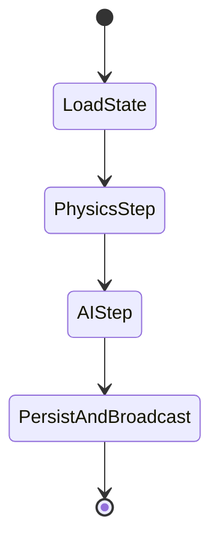

```markdown
<!--
File: LedgerQuestEngine/docs/architecture/adr/001-serverless-game-loop.md
Title: ADR-001 – Serverless Game Loop
-->
# ADR-001 – Serverless Game Loop

| Attribute       | Value                                                            |
|-----------------|------------------------------------------------------------------|
| **Status**      | Accepted                                                         |
| **Date**        | 2024-05-07                                                       |
| **Deciders**    | @tech-lead, @principal-engineer, @platform-architect             |
| **Tags**        | game-loop, serverless, step-functions, dynamodb, eventbridge      |

---

## 1. Context

LedgerQuest Engine is tasked with delivering **real-time, multi-tenant gameplay** while meeting **business-grade** requirements such as cost-efficiency, compliance, and virtually unlimited scale.  
Traditional game loops are monolithic and heavily stateful, typically running at 30–144 FPS.  
Running such loops 24 × 7 across thousands of tenants would be **prohibitively expensive** on always-on compute.

Key constraints:

1. **Pay-per-request**: Idle costs must approach zero.
2. **Elastic latency**: Sub-250 ms E2E latency for interactive scenes.
3. **Deterministic state**: Authoritative state must be persisted for audit & replay.
4. **Composable**: Engine subsystems (physics, AI, networking) must evolve independently.
5. **Fault isolation**: A single tenant’s spike must not degrade others.

After evaluating container-based and traditional dedicated servers, we concluded that **AWS Step Functions + Lambda** is the only approach satisfying all constraints.

---

## 2. Decision

1. **Decompose** the canonical game loop into **stateless Lambda micro-ticks** orchestrated by **AWS Step Functions Standard Workflows**.  
   Each tick is < 900 ms, bounded by the Lambda invocation limit.

2. **Persist** authoritative game state in **DynamoDB** using *single-table, multi-tenant* design with strict `tenant_id` partition keys + **record-level encryption**.

3. **Emit** all side-effects through **Amazon EventBridge** for downstream consumers (audit logs, analytics, in-game notifications).

4. **Overflow workloads** (GPU rendering, bulk physics) are off-loaded to **AWS Fargate** tasks triggered via **Step Functions `Map` states**.

5. **WebSocket sessions** are managed by **API Gateway (WebSocket flavor)**. Clients send commands that enqueue a **StartExecution** call on a *per-session* Step Function.

6. **Deterministic lock-free concurrency** is obtained using **DynamoDB conditional writes** (`ConditionExpression`) and **optimistic versioning**.

---

## 3. Detailed Mechanics

### 3.1 State Machine Definition (Simplified)

```python
# file: infra/game_loop_state_machine.py
import aws_cdk.aws_stepfunctions as sfn
import aws_cdk.aws_stepfunctions_tasks as tasks
from constructs import Construct

class GameLoopStateMachine(Construct):
    """
    Orchestrates a single tick of the serverless game loop.
    """
    def __init__(self, scope: Construct, id_: str, *, table, physics_fn, ai_fn, persist_fn, **kwargs):
        super().__init__(scope, id_, **kwargs)

        # 1. Load state
        load_state = tasks.DynamoGetItem(
            self, "LoadState",
            key={"pk": tasks.DynamoAttributeValue.from_string(sfn.JsonPath.string_at("$.tenant_id"))},
            table=table,
            result_path="$.state"
        )

        # 2. Physics step
        physics_step = tasks.LambdaInvoke(
            self, "PhysicsStep",
            lambda_function=physics_fn,
            result_path="$.physics"
        )

        # 3. AI step
        ai_step = tasks.LambdaInvoke(
            self, "AIStep",
            lambda_function=ai_fn,
            result_path="$.ai"
        )

        # 4. Persist & Broadcast
        persist = tasks.LambdaInvoke(
            self, "PersistAndBroadcast",
            lambda_function=persist_fn,
            retry_on_service_exceptions=True,
            result_path="$.persist_result"
        )

        # Compose definition
        definition = (
            load_state
            .next(physics_step)
            .next(ai_step)
            .next(persist)
        )

        self.state_machine = sfn.StateMachine(
            self, "GameLoopSM",
            definition=definition,
            timeout=core.Duration.seconds(10),   # generous for bursty steps
        )
```

### 3.2 Activity Diagram



### 3.3 Lambda Micro-services

All Lambda functions follow **hexagonal architecture**:

```
├── handler.py
├── domain
│   ├── __init__.py
│   ├── physics.py
│   └── ai.py
├── infrastructure
│   ├── dynamodb_gateway.py
│   └── eventbridge_gateway.py
└── tests/
```

They are **fully stateless**, receiving an *immutable* JSON event that includes:

```json
{
  "tenant_id" : "acme-corp",
  "frame_id"  : 342987,
  "command_batch": [ ... ]
}
```

Each function validates input via **Pydantic** models, then delegates to domain logic.  
Any unexpected exception is re-raised; Step Functions’ automatic retries & DLQs ensure **at-least-once** execution semantics.

---

## 4. Consequences

Positive:

* ✅ Idle cost ≈ 0. We pay only for executed frames.
* ✅ Horizontal scale is automatic—each step is naturally parallel across tenants.
* ✅ Audit compliance: every state mutation is a DynamoDB record & EventBridge event.
* ✅ Subsystems can be deployed independently (physics version `v2` can coexist with AI version `v5`).

Negative / Trade-offs:

* ❌ Cold-start latency. Mitigated via **provisioned concurrency** during peak hours.
* ❌ 900 ms hard limit for a micro-tick. Complex scenes must split over multiple ticks.
* ❌ Step Functions execution history impacts cost; we truncate history via `TTL`.

---

## 5. Alternatives Considered

| Option                                      | Reason Rejected                                                 |
|---------------------------------------------|-----------------------------------------------------------------|
| **“Always-on” ECS / Kubernetes fleet**      | Fails idle-cost constraint; heavier ops overhead.               |
| **Agones-based dedicated game servers**     | Optimised for fast-twitch games; not multi-tenant friendly.     |
| **Pure Lambda (no orchestrator)**           | Hard to manage complex error-handling, versioning, fan-out.     |
| **EventBridge Pipes without Step Functions**| Lacks step-level retries, wait-state semantics, & observability.|

---

## 6. Links

* [AWS Docs – Step Functions Best Practices](https://docs.aws.amazon.com/step-functions/latest/dg/bp.html)  
* [ServerlessLand Pattern – WebSocket to Step Functions](https://serverlessland.com/patterns/apigw-websocket-stepfunctions)  
* [Gamasutra Post – “Deterministic Lock-Step in Cloud”](https://example.com/deterministic-lockstep)  

---

## 7. Decisions Revisited

We will revisit this ADR when either:

1. AWS releases **Lambda SnapStart for Python** (cold-start relief), or  
2.  > 20 % of game loops exceed the 900 ms limit, indicating fragmentation overhead.

---
```