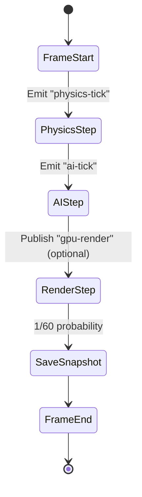

```markdown
# LedgerQuest Engine — Architecture Overview
_A serverless, business-grade game framework for interactive SaaS experiences_

---

## 1. Architectural Tenets
1. **Serverless–First**  
   Every execution path is decomposed into fine-grained, stateless Lambdas, Step Functions, or Fargate tasks. This removes all **always-on** costs and yields “pay-for-play” economics.

2. **Event-Driven Everything**  
   Scene mutations, player inputs, AI ticks, and business telemetry ride the same EventBridge bus enabling loose-coupling, auditability, and near-infinite horizontal scale.

3. **Enterprise-Grade Governance**  
   Multi-tenant isolation, field-level encryption, and immutable audit logs are baked in through KMS, DynamoDB Streams, and CloudTrail integration—**without** sacrificing < 20 ms game-loop latency.

4. **Pure ECS (Entity-Component-System)**  
   Engine internals embrace a data-oriented ECS that maps cleanly onto distributed storage (DynamoDB) and compute (Lambda). Functional “Systems” are individually deployable as versioned Lambda layers.

---

## 2. High-Level System Diagram

```mermaid
flowchart TD
    subgraph Client Tier
        WebGL -->|WebSocket| APIGW_WS
        Unity3D -->|REST/GraphQL| APIGW_HTTP
    end

    subgraph Control Plane
        CI/CD --> CodePipeline --> {Canary Tests}
    end

    subgraph Game Plane
        APIGW_WS --> Lambda_InputRouter
        APIGW_HTTP --> Lambda_InputRouter
        Lambda_InputRouter --> EventBridge
        EventBridge -->|ai-tick| Lambda_AI
        EventBridge -->|physics-tick| Lambda_Physics
        EventBridge -->|scene-save| Lambda_Serializer
        EventBridge --> StepFunction_GameLoop
        StepFunction_GameLoop --> Lambda_AI
        StepFunction_GameLoop --> Lambda_Physics
        StepFunction_GameLoop --> Fargate_GPU
    end

    subgraph Data Plane
        DynamoDB[(ECS Tables)]
        S3[(Assets + Saves)]
        Timestream[(Telemetry)]
        DynamoDBStreams --> Lambda_Audit
    end

    Lambda_AI --> DynamoDB
    Lambda_Physics --> DynamoDB
    Lambda_Serializer --> S3
    Fargate_GPU --> S3
```

---

## 3. Layered Architecture

1. **Presentation Layer**  
   • Thin clients (React + Three.js, Unity, or native)  
   • State updates via WebSockets; snapshots via pre-signed S3 URLs  

2. **Orchestration Layer**  
   • AWS Step Functions manage deterministic game loops (`≤ 60 Hz`)  
   • Each Lambda/System is idempotent & side-effect-free outside DynamoDB  

3. **Domain Layer**  
   • ECS implementation (`Entity`, `Component`, `System`)  
   • Command bus & Observer pattern enable scripting & modding  

4. **Infrastructure Layer**  
   • AWS CDK Type-Safe IaC (Python)  
   • Multi-account, multi-region, blue-green deployments  

---

## 4. Component Responsibility Matrix

| Concern                | Service / Pattern                  | Rationale                                    |
|------------------------|------------------------------------|----------------------------------------------|
| Physics Simulation     | `Lambda_Physics` (+ Layers: PyBullet) | Deterministic, easily parallelisable         |
| AI Behaviour Trees     | `Lambda_AI` (+ Layer: PyBehaviour) | Fine-grained per-Entity decision loops       |
| Scripting System       | `Lambda_Scripting` (Python / Lua)  | Hot-swappable via Layer versioning           |
| Rendering (Burst)      | `Fargate_GPU` (NV T4g)             | Short-lived cinematic renders & thumbnails   |
| Level Editor           | `AppSync + Lambda_Graph`           | Real-time collaboration with CRDTs           |
| Audit / Compliance     | `Lambda_Audit` + Timestream        | Immutable, query-ready logs                  |

---

## 5. Data Model (ECS Tables)

```plaintext
PartitionKey          SortKey               JSON Payload
────────────────────────────────────────────────────────────────────────
TENANT#<id>           ENTITY#<uuid>         { "components": { ... } }
TENANT#<id>           COMPONENT#Physics     { "mass": 1.2, ... }
TENANT#<id>           COMPONENT#Transform   { "pos": [x,y,z], ... }
```

*Each component type is stored as a distinct item to maximise targeted updates and **avoid hot partitions**.*

---

## 6. Game Loop Orchestration (Step Functions)



• **Max Duration**: 16 ms per tick (60 FPS target)  
• **Timeout Strategy**: Any System Lambda > 10 ms triggers circuit-breaker → degrade to 30 FPS for that tenant only.

---

## 7. Sample System Lambda (Physics)

```python
# file: ledgerquest/systems/physics.py
import json
import os
from decimal import Decimal
from typing import Dict, Any

import boto3
import pybullet as pb
from botocore.config import Config

DYNAMO = boto3.resource(
    "dynamodb",
    config=Config(retries={"max_attempts": 3, "mode": "standard"})
).Table(os.environ["ECS_TABLE"])

def lambda_handler(event: Dict[str, Any], _context) -> Dict[str, Any]:
    """
    Apply a single physics tick to the subset of entities that have
    both Transform and Physics components.
    `event` originates from EventBridge "physics-tick".
    """
    tenant_id = event["detail"]["tenant_id"]
    try:
        entities = _fetch_entities(tenant_id)
        updated = _simulate(entities)
        _persist(tenant_id, updated)
        return {"status": "ok", "count": len(updated)}
    except Exception as exc:            # noqa: BLE001
        # Forward to DLQ for inspection; preserve idempotency by *not* re-raising
        _send_to_dlq(event, exc)
        return {"status": "error", "message": str(exc)}

def _fetch_entities(tenant_id: str) -> list[dict]:
    """Query DynamoDB for all Physics components within the current shard."""
    resp = DYNAMO.query(
        KeyConditionExpression="PartitionKey = :tenant AND begins_with(SortKey, :prefix)",
        ExpressionAttributeValues={":tenant": f"TENANT#{tenant_id}", ":prefix": "COMPONENT#Physics"},
        ConsistentRead=False,
    )
    return resp["Items"]

def _simulate(entities: list[dict]) -> list[dict]:
    """Run deterministic physics and return updated transforms."""
    pb.connect(pb.DIRECT)  # No GUI in Lambda
    updated: list[dict] = []
    for comp in entities:
        e_id = comp["EntityId"]
        mass = float(comp["mass"])
        # Simplified example; real implementation would batch bodies
        vel_x, vel_y, vel_z = 0.0, -9.81, 0.0
        pos = comp["pos"]
        new_pos = [pos[0] + vel_x, pos[1] + vel_y * 0.016, pos[2] + vel_z]
        updated.append({"EntityId": e_id, "pos": new_pos})
    pb.disconnect()
    return updated

def _persist(tenant_id: str, entities: list[dict]) -> None:
    """Persist updated Transform components using PartiQL batch."""
    statements = [
        {
            "Statement": (
                "UPDATE \"{table}\" "
                "SET JSONPayload.pos = ? WHERE PartitionKey = ? AND SortKey = ?"
            ).format(table=DYNAMO.table_name),
            "Parameters": [[Decimal(str(p)) for p in e["pos"]], f"TENANT#{tenant_id}", f"COMPONENT#Transform#{e['EntityId']}"]
        }
        for e in entities
    ]
    DYNAMO.meta.client.batch_execute_statement(Statements=statements)

def _send_to_dlq(event: dict, exc: Exception) -> None:
    """Push failed message into SQS dead-letter queue."""
    import boto3, json, os
    sqs = boto3.client("sqs")
    sqs.send_message(
        QueueUrl=os.environ["DLQ_URL"],
        MessageBody=json.dumps({"event": event, "error": str(exc)}),
    )
```

---

## 8. Error Handling & Observability
• **Retries**: Lambda is configured with max 2 retries; Step Functions use `Catch` with exponential backoff.  
• **DLQs**: Each System publishes into a tenant-scoped DLQ.  
• **Tracing**: AWS X-Ray auto-instrumentation via Lambda Powertools.  
• **Metrics**: Custom CloudWatch metrics (`FrameTime`, `PhysicsBodies`, `AIThinkTime`) feed into Game-SLA alarms.

---

## 9. Security & Compliance
1. **Multi-Tenant Key Isolation** — Every tenant has a dedicated KMS CMK; Envelope encryption for S3 assets.  
2. **Audit Trail** — Immutable, append-only log written by `Lambda_Audit` (backed by DynamoDB Streams + Timestream).  
3. **Fine-Grained IAM** — Inline policies generated per-tenant limiting data path to `TENANT#<id>*`.  
4. **Zero-Trust Networking** — No public subnets; Fargate tasks receive traffic only via PrivateLink from API GW.

---

## 10. Extensibility Points
• **Custom Systems** — Drop a Python module in `ledgerquest/systems`; register via CDK `SystemStack`.  
• **Behaviour Trees** — Author YAML or Behaviour3 JSON; deployed as S3 objects consumed by `Lambda_AI`.  
• **Scripting** — Python (restricted) or Lua executed in a `sandboxes-v2` Lambda layer with seccomp profile.

---

## 11. Deployment Pipeline (CI/CD)

```yaml
# simplified .github/workflows/deploy.yml
name: Deploy LedgerQuest Engine

on:
  push:
    branches: [ main ]

jobs:
  test-and-deploy:
    runs-on: ubuntu-latest
    steps:
      - uses: actions/checkout@v4
      - name: Run unit tests
        run: |
          pip install -r requirements-dev.txt
          pytest
      - name: CDK Synth & Deploy
        env:
          AWS_ACCESS_KEY_ID: ${{ secrets.AWS_ID }}
          AWS_SECRET_ACCESS_KEY: ${{ secrets.AWS_SECRET }}
        run: |
          pip install -r infra/requirements.txt
          cdk synth
          cdk deploy --require-approval never
```

---

## 12. Roadmap
- [ ] Support for deterministic rollback (*lockstep*) multiplayer  
- [ ] WASM-based scripting sandbox  
- [ ] Machine-learning powered difficulty adjustment  
- [ ] Cost-based optimiser for aggressive cold-start warming  

---

> © 2024 LedgerQuest Labs — Built with ❤️ for developers who believe business software can be **fun**.
```