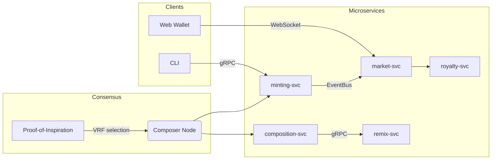

```markdown
# CanvasChain Symphony  
**Modular Blockchain–NFT Platform for Generative & Interactive Art**

[](https://github.com/canvaschain/symphony/actions)  
[](https://discord.gg/canvaschain)  
[](LICENSE)  

CanvasChain Symphony is an immersive, service-oriented blockchain built in Rust.  
It lets digital artists, creative coders and curators compose evolving, multilayer
NFTs whose traits change in real time through on-chain governance, DeFi incentives
and live audience interaction.

---

## Table of Contents
1.  [Quick Start](#quick-start)
2.  [Architecture](#architecture)
3.  [Key Concepts](#key-concepts)
4.  [Microservices](#microservices)
5.  [Rust SDK](#rust-sdk)
6.  [Developer Guide](#developer-guide)
7.  [Testing & Localnet](#testing--localnet)
8.  [Contributing](#contributing)
9.  [Security](#security)
10. [License](#license)

---

## Quick Start
```bash
# 1. Clone recursively (includes protobuf + sub-crates)
git clone --recurse-submodules https://github.com/canvaschain/symphony.git
cd symphony

# 2. Launch local dev-net
make localnet

# 3. Mint your first multilayer NFT
cargo run -p composer_cli -- mint --layers 3 --title "Genesis Brushstroke"
```

---

## Architecture


• **Proof-of-Inspiration (PoI)**: Hybrid PoS + VRF consensus mechanism.  
• **Event Bus**: NATS-JetStream provides at-least-once delivery.  
• **gRPC**: Protocol Buffers for high-performance microservice RPC.  

---

## Key Concepts
| Concept          | Description                                                                                        |
|------------------|----------------------------------------------------------------------------------------------------|
| Multilayer NFT   | A single token encapsulating *N* mutable “layers” (audio, SVG, shader code, haptics, etc.).        |
| Factory Pattern  | Chain-native factories spawn customizable NFT “instruments.”                                       |
| Proxy Pattern    | Immutable proxies route calls to upgradable logic contracts.                                       |
| Observer Pattern | Wallets/UI subscribe to real-time trait evolution & ownership changes.                             |
| State Machine    | Deterministic runtime governs layer transitions (draft → minted → remixed).                       |
| Strategy Pattern | Pluggable crypto curves (Ed25519, BLS12-381, Dilithium) without recompilation.                     |

---

## Microservices
| Crate                | Responsibility                               | Major Patterns |
|----------------------|----------------------------------------------|----------------|
| `composer_node`      | PoI leader node, publishes art updates       | State Machine  |
| `composition_svc`    | Converts generative algorithm → SVG/GLTF     | Strategy       |
| `minting_svc`        | On-chain mint & burn, gas metering           | Factory, Proxy |
| `remix_svc`          | Fork/remix existing NFTs                     | Observer       |
| `market_svc`         | Auction, fixed-price, fractional sales       | Event-Driven   |
| `royalty_svc`        | Continuous royalty streaming via Superfluid  | DeFi Protocol  |
| `governance_svc`     | Proposal & voting logic                      | State Machine  |
| `wallet_gateway`     | REST/WebSocket bridge for browsers           | Proxy          |
| `indexer`            | Postgres + Elastic for fast queries          | Observer       |
| `sdk`                | Type-safe Rust client library                | Strategy       |

Each microservice lives in its own crate under `/services/*` and is published
to crates.io with semver guarantees.

---

## Rust SDK
Add the SDK to your project:
```toml
# Cargo.toml
[dependencies]
canvaschain-sdk = { git = "https://github.com/canvaschain/symphony", tag = "v0.8.0" }
tokio = { version = "1", features = ["full"] }
```

### Minting a Multilayer NFT
```rust
use canvaschain_sdk::{
    prelude::*,
    composer::ComposerClient,
    nft::{Layer, MintNftRequest},
};

#[tokio::main]
async fn main() -> Result<()> {
    // 1. Connect to local composer node (gRPC)
    let mut client = ComposerClient::connect("http://127.0.0.1:50051").await?;

    // 2. Define layers
    let layers = vec![
        Layer::new("background", LayerType::Svg("<rect ... />".into())),
        Layer::new("melody", LayerType::Audio(vec![0u8; 44100])),
        Layer::new("shader", LayerType::GlSl("void main() { ... }".into())),
    ];

    // 3. Mint
    let req = MintNftRequest::builder()
        .title("Nocturne in RGB")
        .description("An evolving chromatic study.")
        .layers(layers)
        .royalty_bps(750) // 7.5%
        .build();

    let resp = client.mint_nft(req).await?;
    println!("NFT minted! id = {}", resp.nft_id);

    Ok(())
}
```

### Swapping the Crypto Curve (Strategy Pattern)
```rust
use canvaschain_sdk::crypto::{CurveStrategy, Bls12381, Dilithium};

fn main() -> Result<()> {
    // At runtime decide which curve to use
    let use_post_quantum = std::env::var("PQ").is_ok();

    let strategy: Box<dyn CurveStrategy> = if use_post_quantum {
        Box::new(Dilithium::default())
    } else {
        Box::new(Bls12381::default())
    };

    let keypair = strategy.generate_keypair();
    let msg = b"canvaschain";
    let sig = strategy.sign(&keypair, msg);
    strategy.verify(&keypair.public, msg, &sig)?;

    println!("Signature valid with {}", strategy.name());
    Ok(())
}
```

---

## Developer Guide
1. **Compile Everything**
   ```bash
   cargo check --workspace --all-features
   ```
2. **Regenerate gRPC Stubs**  
   Protobuf definitions live in `/proto/*.proto`.
   ```bash
   make proto
   ```
3. **Run a Single Service**
   ```bash
   cargo run -p minting_svc
   ```
4. **Environment Variables**
   | Var                     | Default         | Description                        |
   |-------------------------|-----------------|------------------------------------|
   | `COMPOSER_SEED`         | `random`        | 12-word mnemonic for PoI staking   |
   | `EVENT_BUS_URL`         | `nats://127.0.0.1:4222` | NATS JetStream endpoint   |
   | `POSTGRES_URL`          | `postgres://…`  | Indexer database connection        |
   | `CHAIN_ID`              | `canvas-local`  | Bech32 prefix & SLIP-44 path       |

5. **Code Style**  
   ```bash
   cargo fmt --all
   cargo clippy --all-targets --all-features -- -D warnings
   ```

---

## Testing & Localnet
```bash
# Spin up full stack (Postgres, NATS, microservices)
docker compose up -d

# Run integration tests
cargo test -p tests --all-features
```
For deterministic unit tests the PoI VRF seed is mocked so that composer
selection is reproducible.

---

## Contributing
Bug reports, feature requests and pull requests are welcome!

1. Fork → Branch → Commit (conventional) → PR.  
2. Make sure `cargo test` and `make lint` pass.  
3. Sign commits (`-S`) to comply with DCO.

See [`CONTRIBUTING.md`](../CONTRIBUTING.md) for full guidelines.

---

## Security
Please report vulnerabilities to security@canvaschain.io.  
See our [SECURITY.md](../SECURITY.md) policy for details on coordinated disclosure.

---

## License
CanvasChain Symphony is released under the MIT License – see [LICENSE](../LICENSE).

Happy composing! 🎶
```