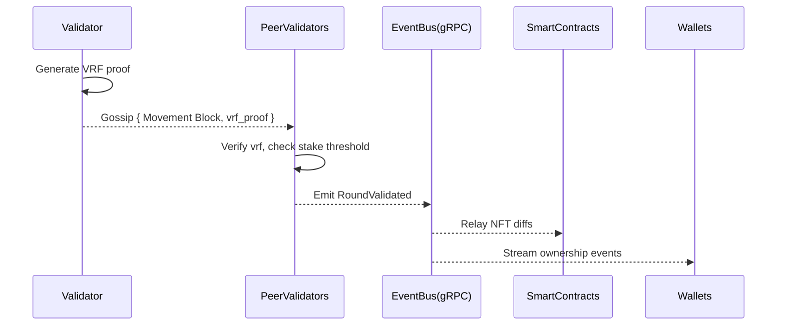

```markdown
# CanvasChain Symphony – Proof-of-Inspiration (PoI) Consensus  
*Version 1.3 – Status: **Draft-Stable***  

---

## 1  Overview
Proof-of-Inspiration (PoI) is CanvasChain Symphony’s bespoke, stake-weighted, VRF-driven consensus that empowers **composer nodes** to publish on-chain creative updates (“movements”).  
PoI combines:

* **Delegated Proof-of-Stake (DPoS)** – capital-efficient security and democratic representation.  
* **Verifiable Random Functions (VRF)** – unbiased, publicly verifiable randomness to ∀ participants.  
* **On-chain Inspiration Score** – dynamic modifier fueled by historical creative performance, rewarding nodes that consistently contribute high-value artwork.

The result is a fast-finality, low-energy, creative-centric protocol optimized for **interactive NFT evolution**.

---

## 2  Design Goals

| Goal                   | Rationale                                               |
|------------------------|---------------------------------------------------------|
| Deterministic yet unpredictable leader election | Prevent censorship & ensure fairness. |
| Human-readable on-chain proofs                 | Facilitate curator audits & gallery integrations. |
| Upgrade-friendly crypto curves (Strategy Pattern) | Support Ed25519, BLS12-381, PQC curves. |
| Slashing for inactivity or malicious art spam | Maintain network & aesthetic integrity. |

---

## 3  Terminology

| Term               | Meaning                                                             |
|--------------------|---------------------------------------------------------------------|
| Composer Node      | Validator eligible to mint a **Movement Block** during a round.     |
| Stake Pool         | Set of delegators backing a validator’s stake.                      |
| Inspiration Score  | Exponential moving average of community upvotes on past work.      |
| Movement Block     | L2 block holding multi-layer NFT diffs + governance meta.           |
| Epoch              | 4 960 blocks (≈ 24 h) after which stake snapshots & rewards settle. |
| Round              | Smallest consensus unit – one Movement Block opportunity.          |

---

## 4  Stake Weighting Formula

```
effective_stake(v) =
    base_stake(v) +
    Σ delegator_balances(v)  ×  loyalty_multiplier(d) +
    inspiration_score(v) × β
```

*`β` is set by governance (default 1 ‰ of total supply).  
*Loyalty multiplier is 1.0 → 1.2 based on delegation age.*

---

## 5  VRF-Based Composer Selection

Each validator performs:

1. Compute `seed = H(epoch_randomness ‖ round_no)`.
2. Evaluate `vrf_out, vrf_proof = VRF_sk(seed)`.
3. Calculate `threshold = 2^256 × effective_stake / total_effective_stake`.
4. If `vrf_out < threshold` → **win** composer slot.

Because `vrf_out` is ∈ [0,2²⁵⁶), the probability of winning is proportional to stake.  
The `vrf_proof` is gossiped with the candidate Movement Block allowing any node to verify:

```rust
pub fn verify_candidate(
    pk: &PublicKey,
    proof: &VrfProof,
    seed: &[u8; 32],
    threshold: U256,
) -> bool {
    match pk.verify_vrf(seed, proof) {
        Ok(vrf_out) => U256::from_big_endian(&vrf_out) < threshold,
        Err(_) => false,
    }
}
```

The Strategy Pattern enables drop-in `verify_vrf` impls for *Ed25519-Dalek*, *blst*, or future PQC curves.

---

## 6  Round Lifecycle



1. **VRF Generation** – Validators lock in their intent ≤ 400 ms.  
2. **Proposal Gossip** – Only one valid Movement Block per round is accepted.  
3. **Fast Finality** – BFT pre-vote + pre-commit (< 2 s).  
4. **Event Hooks** – Once finalized, the Event Bus notifies microservices.  

---

## 7  Slashing & Rewards

| Violation                     | Penalty                         |
|-------------------------------|---------------------------------|
| Double Movement (same round)  | 5 % stake slash + freeze 1 epoch |
| Invalid VRF proof             | 100 % block reward burned       |
| Inactivity ≥ 256 rounds       | 1 % stake slash                 |

Block rewards are split:

* 90 % → Composer + delegators (pro-rata)  
* 10 % → Inspiration Fund for community grants  

---

## 8  Reference Rust Implementation Snippet

```rust
//! PoI core engine – extracts domain logic, free of networking details.

use crate::crypto::{CurveKind, VrfKeypair};
use crate::staking::{StakeLedger, InspirationRegistry};
use crate::types::{EpochRandomness, RoundNumber, MovementBlock};
use anyhow::{anyhow, Result};
use uint::construct_uint;

construct_uint! {
    /// 256-bit unsigned integer.
    pub struct U256(4);
}

pub struct ComposerSelector<'a> {
    stake_ledger: &'a StakeLedger,
    inspiration:  &'a InspirationRegistry,
    curve:        CurveKind,
}

impl<'a> ComposerSelector<'a> {
    pub fn new(
        stake_ledger: &'a StakeLedger,
        inspiration:  &'a InspirationRegistry,
        curve:        CurveKind,
    ) -> Self {
        Self { stake_ledger, inspiration, curve }
    }

    /// Determine whether `keypair` is eligible to compose `round`.
    pub fn evaluate(
        &self,
        keypair: &VrfKeypair,
        epoch_rand: &EpochRandomness,
        round: RoundNumber,
    ) -> Result<Option<(U256 /*vrf_out*/, Vec<u8> /*proof*/)>> {
        // 1. Build seed
        let seed = blake3::hash(&[epoch_rand.as_ref(), &round.to_le_bytes()].concat());
        // 2. Evaluate VRF
        let (vrf_out, proof) = keypair
            .vrf_sign(&seed.as_bytes())
            .map_err(|e| anyhow!("vrf error: {e}"))?;
        // 3. Compute threshold
        let effective = self.stake_ledger.effective_stake(&keypair.public)?;
        let total    = self.stake_ledger.total_effective_stake();
        if total.is_zero() {
            return Err(anyhow!("total stake is zero"));
        }
        let threshold = (U256::MAX / total) * effective; // proportional.
        // 4. Decide
        let out = U256::from_big_endian(&vrf_out);
        if out < threshold {
            Ok(Some((out, proof)))
        } else {
            Ok(None)
        }
    }
}
```

The snippet is dependency-free (besides `blake3`, `uint`, `anyhow`) and demonstrates Strategy-enabled `CurveKind`.

---

## 9  Integration Touch-Points

1. **gRPC Service** `composer.proto` – publishes `SubmitMovement(Block, Proof)` RPC.  
2. **Event Bus Topics**  
   • `movement.finalized` – L2 block header.  
   • `staking.slash`      – Slashing verdicts.  
3. **Smart-Contract Hooks**  
   • `on_movement()` – Allow NFTs to react to fresh traits.  

---

## 10  Future Work

* **MEV-Resistant Inspiration Auctions** – experimental.  
* **Composable ZK-VRF** – hide stake amounts while preserving verifiability.  
* **PQC Migration Path** – NIST finalist lattice-based VRF.

---

## 11  Glossary

* **Movement** – incremental state diff of a multilayer NFT.  
* **Inspiration Fund** – treasury for artists, seeded by protocol inflation.  
* **Strategy Pattern** – runtime-selectable cryptographic backend.

---

© 2024 CanvasChain Contributors – Licensed under Apache-2.0
```