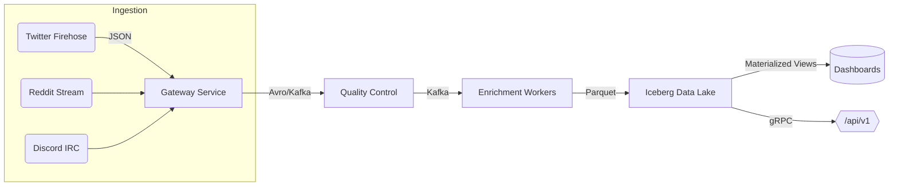

```markdown
# ChirpPulse – Real-Time Social Sentiment Lake

> A production-grade, **Rust-powered**, event-streaming platform that captures, enriches, and analyzes public social chatter _as it happens_.<br>
> Built for **sub-second** latency, **petabyte-scale** retention, and **data-scientist-friendly** extensibility.

[](https://github.com/your_org/chirppulse/actions)
[](https://crates.io/crates/chirppulse)
[](LICENSE)

---

## ✨ Key Features

| Domain                     | Feature                                                                                                    |
|----------------------------|-------------------------------------------------------------------------------------------------------------|
| Stream Processing          | Zero-copy ingestion, back-pressure control, dynamic topic routing, _exactly-once_ semantics via **Kafka** |
| Enrichment & ETL           | Strategy-pattern plug-ins (language detection, toxicity scoring, graph extraction, location resolution)    |
| Storage & Lakehouse        | **Apache Iceberg** tables (schema evolution, partition pruning, ACID)                                      |
| Query & Analytics          | Real-time aggregations with **Materialize** connectors; batch OLAP via **DuckDB**                          |
| Observability & Resilience | Self-healing consumer groups, end-to-end tracing (OpenTelemetry), circuit-breaker patterns                 |
| Deployment                 | Kubernetes Helm charts, `docker-compose` sandbox, GitHub Actions CI/CD                                     |

---

## 🏗️ Architecture Overview



* **Gateway Service** – Authenticates providers, normalizes payloads, and writes events to Kafka topics.<br>
* **Quality Control** – Deduplicates, validates schema, and enforces PII removal.<br>
* **Enrichment Workers** – _Hot-swappable_ algorithms, loaded via the Strategy pattern.<br>
* **Data Lake** – Iceberg tables stored on S3/GCS; versioned with snapshots.<br>
* **Dashboards & API** – Serve insights to humans and automated agents.

---

## 🚀 Quick Start (Local Sandbox)

> Requirements: `docker`, `docker-compose`, and ~6 GB free RAM.

```bash
git clone https://github.com/your_org/chirppulse.git
cd chirppulse

# Spin up Kafka, Schema Registry, Iceberg, and all microservices
make up      # or: docker-compose up --build

# Tail logs
make logs

# Shut everything down
make down
```

Once containers are healthy, open:

* Grafana – http://localhost:3000  (user/pass: admin/admin)
* API Playground – http://localhost:8080/docs
* Materialize SQL – `psql materialize://materialize@localhost:6875/materialize`

---

## 🦀 Rust Workspace Layout

```
chirppulse/
├── crates/
│   ├── chirppulse-common/      # Models, error types, telemetry
│   ├── chirppulse-ingest/      # Gateway service
│   ├── chirppulse-qc/          # Quality-control service
│   ├── chirppulse-enrich/      # Enrichment workers
│   ├── chirppulse-lake/        # Iceberg abstraction layer
│   └── chirppulse-cli/         # CLI & admin tooling
└── services/                   # Docker images, configs
```

---

## 📝 Example: Writing a Custom Enrichment Strategy

```rust
use async_trait::async_trait;
use chirppulse_common::{
    model::{Event, EnrichedEvent},
    strategy::{EnrichmentError, EnrichmentStrategy},
};

/// A toy sentiment analyzer that counts positive words.
pub struct SimpleSentiment;

#[async_trait]
impl EnrichmentStrategy for SimpleSentiment {
    async fn enrich(&self, ev: Event) -> Result<EnrichedEvent, EnrichmentError> {
        let positives = ["great", "awesome", "🎉", "🚀"];
        let score = ev
            .body
            .split_whitespace()
            .filter(|word| positives.contains(word))
            .count() as f32;

        Ok(EnrichedEvent {
            metadata: ev.metadata,
            body: ev.body,
            sentiment_score: score,
            ..Default::default()
        })
    }

    fn name(&self) -> &'static str {
        "simple_sentiment"
    }
}
```

Register the strategy at runtime:

```rust
// in enrich/src/main.rs
use chirppulse_enrich::Pipeline;

#[tokio::main]
async fn main() -> anyhow::Result<()> {
    let mut pipeline = Pipeline::new().await?;
    pipeline.register(Box::new(SimpleSentiment));
    pipeline.run().await
}
```

Thanks to dynamic reloading, new strategies can be hot-swapped without downtime:

```bash
cargo build -p chirppulse-enrich --release
kill -USR1 $(pidof chirppulse-enrich)   # triggers hot reload
```

---

## 🔒 Security

* All crates undergo `cargo audit` in CI.
* TLS enforced on all external network paths.
* Sensitive fields (e.g., auth tokens) are sealed using **age** before persistence.

---

## 📊 Telemetry & Monitoring

Component      | Endpoint                 | Port | Note
---------------|--------------------------|------|---------------------------------------------
Prometheus     | `/metrics`               | 9090 | Metrics scraped every 15 s
Grafana        | —                        | 3000 | Pre-baked dashboards
Jaeger         | `/api/traces`            | 6831 | End-to-end tracing

---

## 🗓️ Scheduling Batch Jobs

Long-running aggregations are orchestrated via **cron-backed** Airflow DAGs invoking the same Rust library (`chirppulse-lake`). A sample DAG is located in `airflow/dags/hourly_sentiment.py`.

---

## 🛠️ Development

```bash
rustup override set stable
cargo fmt -- --check
cargo clippy --all --all-targets -- -D warnings
cargo test --all --release
```

### Common `make` targets

| Target        | Description                        |
|---------------|------------------------------------|
| `make up`     | Boot local stack                   |
| `make down`   | Tear down local stack              |
| `make lint`   | Formatting + Clippy                |
| `make test`   | Unit + integration tests           |
| `make bench`  | Criterion benchmarks               |

---

## 🤝 Contributing

1. Fork & create a feature branch.
2. Install the pre-commit hooks: `pre-commit install`.
3. Write tests and ensure `make test` passes.
4. Submit a PR and sign the DCO.

---

## 📜 License

ChirpPulse is licensed under the **Apache 2.0** License – see [`LICENSE`](LICENSE) for details.

---

© 2024 Your Organization. All rights reserved.
```