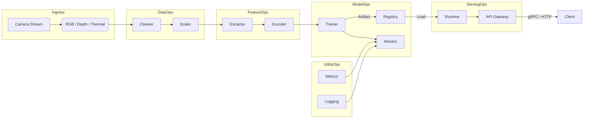

```markdown
<!--
    VisuTility Orchestrator – API Reference
    ======================================

    File: docs/api.md
    Copyright © 2024 VISU-TECH
    License: Apache-2.0
-->

# VisuTility Orchestrator – Public API

VisuTility Orchestrator (a.k.a. `vu-orchestrator`) is a **layered, modular, and
idiomatic Rust framework** for large-scale computer-vision operations.  
This document is the **single source of truth** for *all* public,
stable APIs—Rust crates, gRPC/REST services, CLI commands, and FFI bindings.

> ℹ️  **Audience**: Rust engineers, MLOps teams, DevOps/SRE, and downstream
> applications integrating with VisuTility.

---

## 1. Architectural Snapshot



Each sub-system exposes a **stable trait-based interface** in Rust, mirrored by
protobuf service definitions for remote execution.

---

## 2. Rust Crate Layout

```text
visutility-orchestrator/
├── ingress/
│   └── src/lib.rs           # `IngressProvider` trait
├── data_ops/
│   └── src/lib.rs           # `DataOpsPipeline`
├── feature_ops/
│   └── src/lib.rs           # `FeatureEngineer`
├── model_ops/
│   └── src/lib.rs           # `ModelTrainer`
├── serving_ops/
│   └── src/lib.rs           # `ServingRuntime`
└── utility_ops/
    └── src/lib.rs           # `Telemetry`
```

Public re-exports are gathered in the top-level crate `visutility`.

---

## 3. Core Rust Traits

### 3.1 IngressProvider

```rust
/// A pull-based abstraction for any camera or video source.
///
/// Implementors should *not* perform heavy computation; instead they
/// yield `cv::Mat` frames quickly to keep pipelines non-blocking.
///
/// # Errors
/// Implementations must convert hardware/IO failures into
/// `IngressError`, preserving cause chains for structured logging.
pub trait IngressProvider: Send + Sync + 'static {
    fn next_frame(&mut self) -> Result<Frame, IngressError>;
    fn metadata(&self) -> IngressMetadata;

    /// Optional hint for downstream batching.
    fn fps(&self) -> u16 {
        30
    }
}
```

#### Example

```rust,no_run
use visutility::ingress::{UsbCamProvider, IngressProvider};

let mut cam = UsbCamProvider::new("/dev/video0")?;
loop {
    let frame = cam.next_frame()?;
    // Forward to pipeline …
}
```

### 3.2 DataOpsPipeline

```rust
/// A pipeline of pure transformations on raw frames.
///
/// Typical stages: denoise → normalize → scale → augment
pub trait DataOpsPipeline: Send {
    fn process(&self, frame: Frame) -> Result<Frame, DataOpsError>;
}
```

Out-of-the-box implementations:

```rust
pub type DefaultDataOps = Pipeline<(
    Denoise,
    Normalize,
    Resize<1280, 720>,
    RandFlip
)>;
```

### 3.3 FeatureEngineer

```rust
/// Extracts domain-specific tensors from frames.
///
/// Examples: key-points, optical flow, HOG, embeddings.
pub trait FeatureEngineer: Send {
    fn extract(&self, frame: &Frame) -> Result<Features, FeatureError>;
}
```

### 3.4 ModelTrainer

```rust
/// Wraps training, hyper-parameter tuning, and registry commit.
///
/// Follows the *Strategy Pattern*: algorithms are opaque; the orchestrator
/// chooses the appropriate trainer via the **Factory Pattern**.
#[async_trait::async_trait]
pub trait ModelTrainer {
    async fn train(
        &self,
        dataset: DatasetHandle,
        cfg: TrainConfig,
    ) -> Result<ModelArtifact, TrainError>;

    fn supported_modalities(&self) -> &[CameraModality];
}
```

### 3.5 ServingRuntime

```rust
#[async_trait::async_trait]
pub trait ServingRuntime: Sized + Send + Sync {
    async fn infer(
        &self,
        input: InferenceInput,
    ) -> Result<InferenceOutput, ServingError>;

    fn version(&self) -> &ModelVersion;
}
```

### 3.6 Telemetry

```rust
/// Collected metrics, traces, and event logs.
pub trait Telemetry: Send + Sync {
    fn record_metric(&self, m: Metric);
    fn record_span<F, R>(&self, span: Span, f: F) -> R
    where
        F: FnOnce() -> R;
}
```

---

## 4. gRPC & REST Endpoints

Service | gRPC | REST (OpenAPI) | Description
------- | ---- | -------------- | -----------
Ingress  | `visu.ingress.v1.IngressService` | `/api/v1/ingress` | Register / deregister camera streams.
Dataset  | `visu.data.v1.DatasetService`   | `/api/v1/datasets` | CRUD for datasets.
Training | `visu.train.v1.TrainService`    | `/api/v1/train`    | Launch, stop, and query training jobs.
Serving  | `visu.serve.v1.InferenceService`| `/api/v1/infer`    | Real-time inference endpoint.
Registry | `visu.registry.v1.RegistryService` | `/api/v1/registry`| Model versioning and promotion.

Protobuf definitions are in `proto/` and published to Buf.

---

## 5. CLI Commands

```text
vuctl (VisuTility Control)
USAGE:
    vuctl <COMMAND>

COMMANDS:
    ingest     Register cameras
    train      Kick off training runs
    deploy     Promote a model to production
    status     Show runtime / job status
    logs       Tail logs and metrics
```

Example:

```bash
$ vuctl train start -d ds://warehouse/day_shift -m yolox_l -p epochs=30,lr=1e-4
```

---

## 6. Error Model

All public errors implement:

```rust
pub trait OrchestratorError: std::error::Error + Send + Sync + 'static {
    fn kind(&self) -> ErrorKind;
    fn ctx(&self) -> ErrorContext;
}
```

Errors are convertible into gRPC `Status` codes and HTTP `ProblemDetails`.

---

## 7. Concurrency & Back-Pressure Guarantees

1. Tokio multi-thread runtime (scheduler = `tokio::runtime::Builder::new_multi_thread()`).
2. MPSC *bounded* channels between layers; capacity tuned via env
   `VU_PIPELINE_QUEUE_SIZE` (default: `512`).
3. Circuit-breaker with exponential back-off on downstream saturation.

---

## 8. FFI Bindings

### 8.1 Python

The `visutility-py` wheel is built using PyO3/maturin.

```python
import visutility_py as vu

runtime = vu.ServingRuntime.load("warehouse-detector/v3")
result = runtime.infer("/path/img.png")
print(result.json(indent=2))
```

### 8.2 C++

```cpp
#include <visutility-cpp/runtime.hpp>

auto rt = vu::ServingRuntime::load("warehouse-detector/v3");
auto out = rt.infer("/path/img.png");
std::cout << out.json() << std::endl;
```

---

## 9. Versioning & Stability

Semantic Versioning (SemVer) 2.0.  
Breaking changes to any symbol, endpoint, or CLI flag will result in a **major
version bump**.

---

## 10. Security & Compliance

• TLS 1.3 everywhere  
• SBOM generated via `cargo auditable`  
• Images are scanned by Trivy during CI  
• GDPR & CCPA compliant: PII is purged in `DataOpsPipeline` before persistence.

---

## 11. Contribution Guide

1. Open a GitHub issue for discussion.  
2. Follow the RFC template under `.github/` for API changes.  
3. Rust code must pass `cargo clippy --all-targets -- -D warnings`.  
4. New public APIs require documentation and *two* approving reviewers.

---

## 12. Quick-Start

```rust,no_run
use visutility::{
    ingress::UsbCamProvider,
    data_ops::DefaultDataOps,
    feature_ops::OrbExtractor,
    model_ops::{RandomForestTrainer, TrainConfig},
    serving_ops::LocalRuntime,
};

#[tokio::main]
async fn main() -> anyhow::Result<()> {
    // Ingress
    let mut cam = UsbCamProvider::new("/dev/video0")?;

    // DataOps
    let data_ops = DefaultDataOps::default();

    // FeatureOps
    let fe = OrbExtractor::default();

    // Loop
    let frame = cam.next_frame()?;
    let clean = data_ops.process(frame)?;
    let feat  = fe.extract(&clean)?;

    // Train (offline)
    let trainer = RandomForestTrainer::default();
    let artifact = trainer.train("s3://datasets/warehouse", TrainConfig::default()).await?;

    // Serve
    let runtime = LocalRuntime::from_artifact(artifact)?;
    let result  = runtime.infer(feat).await?;

    println!("Inference result: {result:?}");
    Ok(())
}
```

---

### End-of-Document
```