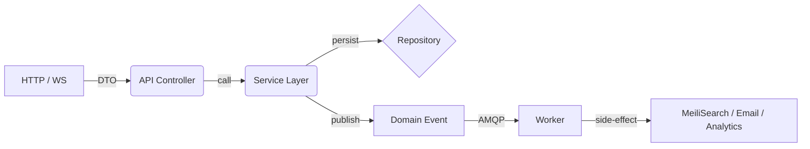

```markdown
# EduPulse Live – Event-Driven Social Learning Hub


EduPulse Live is an expert-level, event-driven social network for educators and learners that blends course discussions, real-time collaboration, and academic resource sharing.  
Every domain concept—lesson publication, quiz submission, peer feedback, badge awards, or payment for premium micro-courses—**emits domain events** that flow through a message broker, keeping the core HTTP API lean and highly responsive.

> TL;DR  
> `cargo run --package web_social` will spin up the API on <https://localhost:8080>, publish domain events to **RabbitMQ**, persist state in **PostgreSQL**, index resources in **MeiliSearch**, and serve a blazing-fast interactive SPA via **Trunk + Wasm**.

---

## ✨ Key Capabilities

| Category            | Highlights                                                                              |
|---------------------|-----------------------------------------------------------------------------------------|
| Real-time Learning  | “Learning pulses”, live Q&A threads, WebSocket rooms, in-browser code runners           |
| Event-Driven Core   | Every aggregate action produces a strongly-typed CloudEvent                             |
| Search & Discovery  | Incremental MeiliSearch indexing via asynchronous workers                               |
| Achievements        | Badge / XP engine powered by event-sourced projections                                  |
| Compliance          | GDPR “right to be forgotten” implemented as compensating erase events                   |
| Secure by Default   | TLS-terminated, OAuth2 (Google EDU, Microsoft), rotating Redis sessions, rate limiting  |

---

## 🏗️  Tech Stack

* **Rust 1.74+**   – Actix Web, Tokio, SeaORM  
* **RabbitMQ 3.12** – AMQP 0-9-1 event bus  
* **PostgreSQL 15** – primary data store, CQRS projections  
* **MeiliSearch 1.4** – full-text search  
* **Redis 7**        – cache + session store  
* **React 18 + WASM** – front-end (see `/frontend`)  

---

## 🚀 Quick Start

```bash
git clone https://github.com/edupulse/live.git
cd live

# 1. Configure environment variables
cp .env.example .env
vi .env           # adjust DB urls, secrets, etc.

# 2. Database & broker
docker compose up -d postgres rabbitmq redis meilisearch

# 3. Apply migrations
cargo install sea-orm-cli
sea migrate up

# 4. Run the whole stack (API + workers)
cargo make dev         # dev profile with hot-reloading (`cargo-make` is a dev-dependency)

# 5. Hit the health-check
curl -k https://localhost:8080/healthz
```

`make dev` orchestrates:

* `web_social` (Actix HTTP API)
* `social_worker` (background AMQP consumer)
* `trunk serve` (front-end local dev)

---

## 🗂️ Repository Layout

```
.
├── crates
│   ├── domain          # Domain aggregates, value objects, events
│   ├── web_social      # REST/WS API crate (Actix)
│   ├── social_worker   # Async workers (search, mail, achievements…)
│   └── shared          # Cross-cutting (error types, tracing, config)
├── frontend            # React + WASM widgets
└── deploy              # Helm charts, Terraform, GitHub Actions
```

---

## 🧩 Architecture Primer

We follow a pragmatic **Service-Layer + Repository Pattern** with clean separation of concerns.



### 1. Domain Event Definition

```rust
// crates/domain/src/event/pulse.rs
use chrono::{DateTime, Utc};
use serde::{Deserialize, Serialize};
use uuid::Uuid;

/// CloudEvent-compliant wrapper for all domain events
#[derive(Debug, Clone, Serialize, Deserialize)]
pub struct CloudEvent<T>
where
    T: Serialize,
{
    pub id: Uuid,
    pub source: String,
    pub specversion: String,
    pub r#type: String,
    pub datacontenttype: String,
    pub time: DateTime<Utc>,
    pub data: T,
}

/// Specific payload for a LearningPulseCreated event
#[derive(Debug, Clone, Serialize, Deserialize)]
pub struct LearningPulseCreated {
    pub pulse_id: Uuid,
    pub author_id: Uuid,
    pub title: String,
    pub expires_at: DateTime<Utc>,
}
```

### 2. Service Layer Publishes Events

```rust
// crates/web_social/src/service/pulse_service.rs
use domain::event::{CloudEvent, LearningPulseCreated};
use shared::{
    amqp::Publisher,
    db::RepoPool,
    errors::ServiceError,
};

pub struct PulseService {
    repo: RepoPool,
    publisher: Publisher,
}

impl PulseService {
    pub async fn create_pulse(&self, cmd: CreatePulse) -> Result<PulseDto, ServiceError> {
        let pulse = self.repo.pulse().insert(&cmd).await?;
        let event = CloudEvent::from_payload(
            "com.edupulse.pulse.created",
            &LearningPulseCreated {
                pulse_id: pulse.id,
                author_id: pulse.author_id,
                title: pulse.title.clone(),
                expires_at: pulse.expires_at,
            },
        );
        self.publisher.publish(event).await?;
        Ok(PulseDto::from(pulse))
    }
}
```

### 3. Worker Listens & Acts

```rust
// crates/social_worker/src/handlers/search_index.rs
use domain::event::LearningPulseCreated;
use shared::{amqp::Consumer, search::SearchIndexer};

pub async fn start_search_listener(consumer: Consumer, indexer: SearchIndexer) {
    consumer
        .listen::<LearningPulseCreated>("com.edupulse.pulse.created", move |evt| {
            let idx = indexer.clone();
            async move {
                idx.index_pulse(evt.data).await?;
                Ok(())
            }
        })
        .await
        .expect("Search listener crashed");
}
```

---

## 🔒 Security Notes

1. All external traffic is forced through **TLS 1.3** (`rustls`, HSTS, OCSP stapling).  
2. Cookies: `__Secure-sid`, `SameSite=Lax`, 15 min idle, 8 hour absolute, rotated every login.  
3. Input validation enforced at DTO boundaries (`validator` crate).  
4. **Brute-force guard** via Redis-backed sliding window rate limiter.  
5. Secrets managed through `age`-encrypted SOPS files + GitHub OIDC → AWS Secrets Manager.

---

## 🧪 Testing Matrix

| Layer            | Tooling            | Command                           |
|------------------|--------------------|-----------------------------------|
| Unit (lib)       | `cargo test`       | `cargo test --workspace`          |
| Integration API  | `rstest` + `sqlx`  | `cargo test -p web_social it_`    |
| End-to-End       | `playwright`       | `npm run test:e2e` (frontend)     |
| Load / chaos     | `k6` + `tc`        | `make perf`                       |

CI runs on GitHub Actions in parallel Kubernetes jobs with 90%+ branch coverage threshold (gated).

---

## 🙌 Contributing

1. Fork → feature branch (conventional commits please: `feat(api): add reactions`)
2. `cargo fmt && cargo clippy --all-targets -- -D warnings`
3. Open PR; two approvals & green CI required to merge.

See [`CONTRIBUTING.md`](CONTRIBUTING.md) for full guidelines.

---

## 📜 License

EduPulse Live is licensed under the **Apache 2.0** License – see [`LICENSE`](LICENSE).

Happy learning 🎓🚀
```