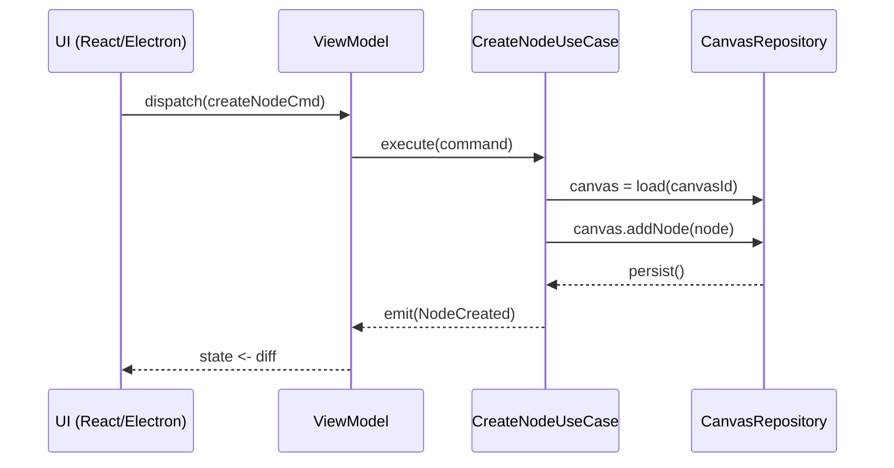

```markdown
# PaletteFlow Studio – Architecture Guide
> Version: `v1.6.x`  
> Audience: Core contributors, plugin authors, DevOps, QA

PaletteFlow Studio is *Clean-Architecture* at its core and *Event-Driven* at its edges.  
The system is intentionally **framework-agnostic** at the Domain and Use-Case layers so that the UI (Electron + React), the CLI, and the plugin runtime can evolve independently.

```
┌────────────────────────────┐
│        Presentation        │  ← UI & Adapters (Electron/React, CLI, Tests)
├────────────────────────────┤
│          View-Model        │  ← MVVM, RXJS, IPC
├────────────────────────────┤
│         Use Cases          │  ← Application Services / Interactors
├────────────────────────────┤
│      Domain Entities       │  ← Canvas, Node, Link, Theme, Workspace
├────────────────────────────┤
│             Core           │  ← Utilities, EventBus, StateMachine, Errors
└────────────────────────────┘
```

Mermaid showing a simplified flow for the “CreateNode” use-case:



---

## 1. Core Domain Layer (`packages/core`)

### 1.1 Entity: `Canvas`

```ts
// packages/core/entities/Canvas.ts
import { v4 as uuid } from 'uuid';
import { Guard, DomainError } from '../shared';

/** A visual container that hosts nodes and their links. */
export class Canvas {
  readonly id: string;
  private _nodes: Map<string, Node> = new Map();
  private _links: Map<string, Link> = new Map();

  private constructor(id: string) {
    this.id = id;
  }

  /* Factory keeps constructor private to safeguard invariants */
  static createEmpty(): Canvas {
    return new Canvas(uuid());
  }

  /** Adds a node and validates that its bounding box is free. */
  addNode(node: Node): void {
    if (this._nodes.has(node.id)) {
      throw new DomainError(`Node with id ${node.id} already exists on canvas ${this.id}.`);
    }
    // Guard for overlapping / bounding boxes, simplified ahead:
    Guard.againstInvalidBoundingBox(node.frame, [...this._nodes.values()]);
    this._nodes.set(node.id, node);
  }

  /** Domain events are recorded for off-board subscribers */
  toDomainEventStream(): DomainEvent[] {
    return [...this._nodes.values()].flatMap(n => n.flushEvents());
  }
}
```

### 1.2 Value Object: `BoundingBox`

```ts
// packages/core/valueObjects/BoundingBox.ts
export interface BoundingBox {
  x: number; y: number; width: number; height: number;
  intersects(other: BoundingBox): boolean;
}

export const BoundingBox = {
  intersects(a: BoundingBox, b: BoundingBox): boolean {
    return (
      a.x < b.x + b.width &&
      a.x + a.width > b.x &&
      a.y < b.y + b.height &&
      a.y + a.height > b.y
    );
  }
};
```

---

## 2. Use-Case Layer (`packages/usecases`)

### 2.1 Interactor: `CreateNode`

```ts
// packages/usecases/CreateNode.ts
import { NodeFactory } from '../core/factories';
import { ICanvasRepository } from './ports/ICanvasRepository';
import { EventBus } from '../core/EventBus';

export interface CreateNodeCommand {
  canvasId: string;
  type: string;
  initialContent?: unknown;
  position: { x: number; y: number };
}

/**
 * Use-case for creating a node. Note that it is framework-agnostic and only
 * depends on abstraction interfaces (`ICanvasRepository`, `EventBus`).
 */
export class CreateNode {
  constructor(
    private readonly repo: ICanvasRepository,
    private readonly eventBus: EventBus
  ) {}

  async execute(cmd: CreateNodeCommand): Promise<void> {
    const canvas = await this.repo.findById(cmd.canvasId);
    const node = NodeFactory.create({
      type: cmd.type,
      position: cmd.position,
      content: cmd.initialContent
    });

    canvas.addNode(node);

    await this.repo.save(canvas);
    this.eventBus.publish(canvas.toDomainEventStream());
  }
}
```

---

## 3. Adapter Layer

### 3.1 Electron Renderer → ViewModel

```ts
// packages/desktop/viewmodels/CanvasVM.ts
import { BehaviorSubject } from 'rxjs';
import { CreateNode } from '../../usecases';
import { ipcRenderer } from 'electron';

export class CanvasVM {
  private readonly state$ = new BehaviorSubject<CanvasState>(initialState);

  constructor(private readonly createNodeUC: CreateNode) {
    ipcRenderer.on('menu:create-node', (_, payload) => this.createNode(payload));
  }

  getState() { return this.state$.asObservable(); }

  async createNode(payload: { type: string; x: number; y: number }) {
    try {
      await this.createNodeUC.execute({
        canvasId: this.state$.value.activeCanvasId,
        type: payload.type,
        position: { x: payload.x, y: payload.y }
      });
    } catch (err) {
      console.error('[CanvasVM] createNode failed', err);
      // TODO: route to notifications store
    }
  }
}
```

---

## 4. Plugin Runtime

Plugins are Node-isolated CommonJS/ESM modules loaded at runtime.  
They *must* export a `PalettePlugin` that adheres to the following interface:

```ts
// packages/plugin-sdk/index.ts
export interface PalettePlugin {
  id: string;
  displayName: string;
  activate(context: PluginContext): void;
  deactivate?(): void;
}

export interface PluginContext {
  logger: Logger;
  registerNodeType(definition: NodeTypeDefinition): void;
  registerTheme(theme: Theme): void;
  commands: CommandRegistry;
}
```

### 4.1 Example Plugin `@palettes/sketchNode`

```ts
// plugins/sketch-node/index.ts
import { PalettePlugin } from 'paletteflow/plugin-sdk';

const SketchPlugin: PalettePlugin = {
  id: 'com.paletteflow.sketch-node',
  displayName: 'Sketch Node',
  activate({ registerNodeType, logger }) {
    logger.info('Activating Sketch Node Plugin');
    registerNodeType({
      id: 'sketch',
      title: 'Sketch',
      component: async () => import('./SketchNodeRenderer'),
      initialContent: { paths: [] }
    });
  }
};

export = SketchPlugin;
```

Plugins are sandboxed using the [`vm2`](https://github.com/patriksimek/vm2) library, preventing malicious file-system access while still giving useful APIs.

---

## 5. State Machine (Node Lifecycle)

Each node has an internal lifecycle expressed as a small `xstate` machine:

```ts
// packages/core/statemachines/nodeLifecycle.ts
import { createMachine, assign } from 'xstate';

interface NodeCtx { dirty: boolean }
type NodeEvt = { type: 'EDIT' } | { type: 'SAVE_SUCCESS' } | { type: 'SAVE_FAILURE', error: Error };

export const nodeLifecycleMachine = createMachine<NodeCtx, NodeEvt>({
  id: 'node',
  initial: 'clean',
  context: { dirty: false },
  states: {
    clean: {
      on: { EDIT: { target: 'dirty', actions: assign({ dirty: _ => true }) } }
    },
    dirty: {
      invoke: {
        src: 'saveNode',
        onDone: { target: 'clean', actions: assign({ dirty: _ => false }) },
        onError: { target: 'error' }
      }
    },
    error: {
      entry: ['notifyError'],
      on: { EDIT: 'dirty' }
    }
  }
});
```

---

## 6. Event Bus & Observer Pattern

The Event Bus is a thin RxJS subject that bridges domain events to interested adapters:

```ts
// packages/core/EventBus.ts
import { Subject } from 'rxjs';

export type DomainEvent =
  | { type: 'NodeCreated'; canvasId: string; nodeId: string }
  | { type: 'ThemeApplied'; workspaceId: string; themeId: string };

export class EventBus {
  private readonly events$ = new Subject<DomainEvent>();

  publish(events: DomainEvent | DomainEvent[]) {
    (Array.isArray(events) ? events : [events]).forEach(evt => this.events$.next(evt));
  }

  subscribe(listener: (evt: DomainEvent) => void) {
    return this.events$.subscribe(listener);
  }
}
```

`CrashReporter`, `AutoUpdater`, and `Analytics` are all *observers* that attach to the `EventBus` and perform side-effects such as telemetry or emergency persistence on crash.

---

## 7. Error Strategy

Errors **never** leak across layers unwrapped.  
We employ a unified `Result<T, E>` type with exhaustive switching in callers.

```ts
// packages/core/shared/Result.ts
export type Result<T, E extends Error = Error> =
  | { ok: true; value: T }
  | { ok: false; error: E };

export const Result = {
  ok<T>(value: T): Result<T, never> { return { ok: true, value }; },
  fail<E extends Error>(error: E): Result<never, E> { return { ok: false, error }; }
};
```

---

## 8. Build Pipeline

1. `pnpm monorepo` workspace → shares versions, scripts, lockfile.
2. `esbuild` for *core* & *use-cases* (fast, tree-shakable).
3. `vite` for renderer; `electron-builder` for desktop packaging.
4. End-to-end tests via Playwright using the [Electron](https://playwright.dev/docs/api/class-electron) driver.
5. Sentry wraps the Electron main and renderer to capture uncaught exceptions.

---

## 9. Key Design Decisions

• Serializable domain events enable *time-travel debugging* and potentially multiplayer sync  
• Plugin system purposely kept **non-eval**; each plugin runs in `vm2` or a WebAssembly sandbox  
• All state lives in “view-models” → React components are *pure views*  
• No “service locator” — dependencies passed via constructors for testability  
• Data persistence uses **executable JSON** (`.pflow.jsonc`) that can be inspected & version-controlled  

---

## 10. Contribution Workflow

```
fork → feature-branch → `pnpm test && pnpm lint` → PR → code-review (2 approvals) → squash merge
```

Add tests next to code (`*.spec.ts`), prefer property-based strategies for entities’ invariants.

Happy hacking 💜
```