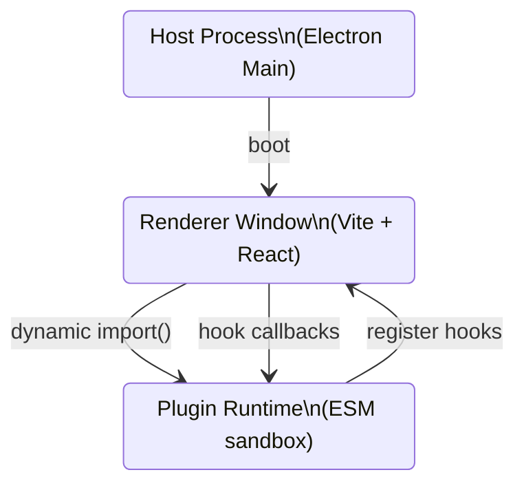

```markdown
<!--
  File: docs/plugin-api/reference/lifecycle-hooks.md
  Package: @paletteflow/studio
  Copyright © PaletteFlow
  This documentation is part of the public, versioned Plugin SDK.
-->

# 🎛  PaletteFlow Studio Plugin Lifecycle Hooks

Plugins in PaletteFlow Studio are *capability-oriented*: they only run when the
host decides they are relevant to the current workspace & user settings.  
The Plugin Runtime therefore exposes a small—but powerful—set of lifecycle
hooks that let you:

* Allocate resources when the plugin is activated and free them later
* React to workspace, node or theme changes
* Intercept save/export pipelines
* Cleanly integrate with the command palette & settings system



<br>

## 1. Quick reference

| Hook                              | Signature                                                                                               | When it fires                                                        |
| --------------------------------- | -------------------------------------------------------------------------------------------------------- | -------------------------------------------------------------------- |
| `onActivate`                      | `(ctx: ActivationContext) ⇒ Disposable\|void`                                                           | **Once** when the plugin is loaded into a renderer process           |
| `onDeactivate`                    | `(ctx: DeactivationContext) ⇒ void`                                                                     | **Once** before the sandbox is torn down                             |
| `onWorkspaceLoad`                 | `(workspace: WorkspaceHandle, opts: WorkspaceLoadOptions) ⇒ Promise\<void\>`                            | Whenever a workspace becomes the current editing target              |
| `onBeforeSave`                    | `(workspace: WorkspaceHandle) ⇒ Promise\<void\>`                                                        | Right before the host serialises a workspace to disk                 |
| `onNodeCreate`                    | `(node: NodeHandle, api: NodeLifecycleAPI) ⇒ void`                                                      | Each time the user creates a new node                                |
| `onNodeRender`                    | `(node: NodeHandle, canvas: CanvasRenderingContext2D) ⇒ void|Promise\<void\>`                           | Whenever the node should be drawn on the viewport                    |
| `onSettingsChange`                | `(delta: DeepPartial\<PluginSettings>) ⇒ void`                                                          | Any time the plugin’s user-configurable settings are patched         |
| `onUnhandledError`                | `(err: unknown, ctx: ErrorContext) ⇒ void`                                                              | Whenever an uncaught error bubbles up inside the plugin runtime      |

All hooks are **optional**.  
Export only what you need:

```ts
// my-awesome-plugin/index.ts
import type {
  ActivationContext,
  NodeLifecycleAPI,
  PluginSettings,
  WorkspaceHandle
} from '@paletteflow/studio/plugin-api';

export const onActivate = (ctx: ActivationContext) => {
  // …
};

export const onNodeCreate = (node: NodeHandle, api: NodeLifecycleAPI) => {
  // …
};
```

<br>

## 2. Hook Definitions

The following TypeScript interfaces live in `@paletteflow/studio/plugin-api`
(they are bundled with the desktop app and version-pinned).

```ts
/* eslint-disable @typescript-eslint/no-explicit-any */
export interface Disposable {
  /** Free resources allocated during onActivate. */
  dispose(): void | Promise<void>;
}

export interface ActivationContext {
  readonly version: string;                     // PaletteFlow version e.g. "1.8.0"
  readonly pluginId: string;                    // e.g. "com.acme.colour-swatches"
  readonly logger: Logger;                      // Namespaced logger
  readonly commandRegistry: CommandRegistry;    // Register palette actions
  readonly settings: Readonly<PluginSettings>;  // Initial settings
  readonly env: 'production' | 'development';   // Sandbox environment
}

export interface DeactivationContext {
  readonly reason: 'app-quit' | 'plugin-update' | 'hot-reload';
}

export interface WorkspaceLoadOptions {
  firstLoad: boolean; // true = the workspace has just been opened
  origin: 'file-open' | 'hot-reload' | 'undo-redo';
}

export interface ErrorContext {
  hook: keyof PluginModule; // Which hook threw
  fatal: boolean;           // Will PaletteFlow crash if not handled?
}
```

<br>

## 3. Writing robust lifecycle code

Below is a *complete* plugin showcasing best practices—cancellable disposables,
solid error handling, and CI-friendly TypeScript.

```ts
/**
 * Colour Swatch Nodes — A demonstration plugin that adds a “ColourSwatch”
 * node type which renders an interactive palette of brand colours.  Users
 * can double-click any swatch to copy its hex code to clipboard.
 *
 * @module com.acme.colour-swatches
 */
import {
  ActivationContext,
  DeactivationContext,
  NodeLifecycleAPI,
  PluginModule,
  WorkspaceHandle
} from '@paletteflow/studio/plugin-api';

import { z } from 'zod'; // Runtime schema validation

// 1) -----------------  Settings schema  ------------------------------------
const SettingsSchema = z.object({
  defaultPalette: z.array(z.string().regex(/^#([0-9a-f]{3}){1,2}$/i))
});

export type PluginSettings = z.infer<typeof SettingsSchema>;

let disposables: (() => unknown)[] = [];
let settings: PluginSettings;

export const onActivate: PluginModule['onActivate'] = (ctx: ActivationContext) => {
  // ── Validate settings coming from host ────────────────────────────
  const result = SettingsSchema.safeParse(ctx.settings);
  if (!result.success) {
    ctx.logger.error('Invalid settings payload', result.error.flatten());
    // Fallback to built-in palette
    settings = { defaultPalette: ['#ffb703', '#fb8500', '#023047'] };
  } else {
    settings = result.data;
  }

  // ── Register a command-palette action ─────────────────────────────
  const disposeCommand = ctx.commandRegistry.register({
    id: `${ctx.pluginId}.insertDefaultSwatch`,
    title: 'Insert Default Colour Swatch',
    run: async () => {
      try {
        const workspace = await ctx.getActiveWorkspace();
        const node = await workspace.nodes.create({
          kind: 'ColourSwatch',
          meta: { palette: settings.defaultPalette }
        });
        ctx.logger.info(`Inserted ColourSwatch node ${node.id}`);
      } catch (err) {
        ctx.logger.error('Failed to insert swatch node', err);
      }
    }
  });

  disposables.push(disposeCommand);

  // Return a Disposable so the host can call it on plugin reload
  return {
    dispose: async () => {
      for (const dispose of disposables.splice(0)) {
        await dispose();
      }
    }
  };
};

export const onDeactivate = (_ctx: DeactivationContext) => {
  // Ensure we free our resources even if the host forgets
  for (const dispose of disposables.splice(0)) {
    // Ignore individual failures but log them
    try {
      dispose();
    } catch (err) {
      /* eslint-disable-next-line no-console */
      console.warn('dispose() failed during onDeactivate', err);
    }
  }
};

export const onWorkspaceLoad: PluginModule['onWorkspaceLoad'] = async (
  workspace: WorkspaceHandle
) => {
  // Migrate legacy node metadata if needed
  const nodes = await workspace.nodes.findByKind('ColourSwatch', { limit: 1000 });
  for (const node of nodes) {
    if (!Array.isArray(node.meta.palette)) {
      await node.patch({ meta: { palette: settings.defaultPalette } });
    }
  }
};

/**
 * Register per-node behaviour — called every time a ColourSwatch node is created.
 * We attach an onClick listener that copies colour codes to clipboard.
 */
export const onNodeCreate: PluginModule['onNodeCreate'] = (
  node,
  api: NodeLifecycleAPI
) => {
  if (node.kind !== 'ColourSwatch') return; // Ignore other node types

  api.events.on('click', async (evt) => {
    const targetHex = (evt.target as HTMLElement)?.dataset['hex'];
    if (!targetHex) return;

    try {
      await navigator.clipboard.writeText(targetHex);
      api.toast.success(`${targetHex} copied to clipboard`);
    } catch (err) {
      api.toast.error('Unable to access clipboard');
      api.logger.error('clipboard.writeText failed', err);
    }
  });
};

/**
 * Custom renderer hook — PaletteFlow calls this whenever the node becomes
 * visible.  We render a row of coloured squares on the canvas.
 */
export const onNodeRender: PluginModule['onNodeRender'] = (node, ctx) => {
  if (node.kind !== 'ColourSwatch') return;

  const palette: string[] = node.meta.palette ?? settings.defaultPalette;
  const { width, height } = node.dimensions;

  const swatchWidth = width / palette.length;

  palette.forEach((hex, idx) => {
    ctx.fillStyle = hex;
    ctx.fillRect(idx * swatchWidth, 0, swatchWidth, height);
  });
};

export const onUnhandledError: PluginModule['onUnhandledError'] = (
  err,
  { hook }
) => {
  // Funnel all uncaught errors to an external error tracker
  import('@paletteflow/studio/crash-reporter').then(({ report }) => {
    report({
      plugin: 'com.acme.colour-swatches',
      hook,
      error: err instanceof Error ? err : new Error(String(err))
    });
  });
};
```

<br>

## 4. Returning Disposables

`onActivate` can synchronously return `void` **or** a `Disposable` (sync or
async).  The host invokes `dispose()` when:

* The plugin is reloaded (during development hot-reload)
* The plugin is disabled from Settings
* The application quits

Keeping a single `CompositeDisposable` or a plain `Array<() ⇒ void>` is a good
pattern, as shown earlier.

```ts
import { CompositeDisposable } from '@paletteflow/studio/utils';

const subs = new CompositeDisposable();

export const onActivate = (_ctx: ActivationContext) => {
  const disposeKeybind = globalKeymap.bind('ctrl+shift+c', () => /* … */);
  subs.add(disposeKeybind);

  return subs; // CompositeDisposable implements dispose()
};
```

<br>

## 5. Threading Model & Re-entrancy

* All hooks run **inside the renderer process** (i.e. a BrowserWindow preload),
  **not** the Node-only main process.  
* Hooks must be designed to be *idempotent*—the host might invoke them again
  after a hot-reload without restarting the entire app.
* Long-running hooks should be async / `Promise`-based to avoid blocking the
  UI thread.

<br>

## 6. Common Pitfalls

1. Forgetting to clean up DOM or canvas event listeners → memory leaks  
2. Performing network requests in `onNodeRender` → jank every frame  
3. Throwing inside `onSettingsChange` with no `onUnhandledError` guard → plugin
   gets auto-disabled by the sandbox  

Use the provided `logger` to trace runtime behaviour rather than relying on
`console.log`, which may be silenced in production builds.

<br>

## 7. Versioning Strategy

The SDK follows **semver**:

* **Patch** releases only add backward-compatible hooks
* **Minor** releases may deprecate existing hooks but never remove them
* **Major** releases can delete old hooks — update your `peerDependencies`!

To future-proof your plugin, always specify a caret range in `package.json`:

```jsonc
{
  "peerDependencies": {
    "@paletteflow/studio": "^1.8.0"
  }
}
```

<br>

---

© 2024 PaletteFlow — Empowering creatives to think in shapes, not files.
```