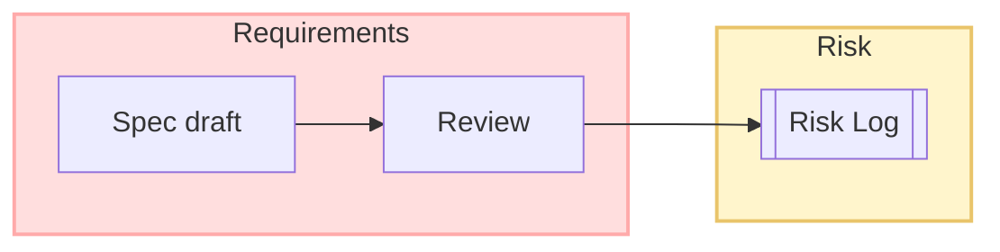

```markdown
---
title: The Canvas
description: Learn everything you need to master PaletteFlow Studio’s infinite canvas—from basic panning and zooming to building programmable, theme-aware node graphs.
sidebar_position: 2
---

# The Canvas

Welcome to **PaletteFlow Studio’s** signature feature: an infinite, zoom-able canvas where *thoughts turn into flows*.  
Whether you are drafting a mind-map, prototyping UI, or wiring up an executable to-do board, every project begins here.

> **Tip** – If this is your first time, spend a few minutes just dragging, zooming, and dropping random files onto the canvas.  
> You can’t break anything: everything is versioned and undo-able.

---

## 1. Navigating the Canvas

| Action                           | Mouse / Trackpad                         | Keyboard                                     |
| -------------------------------- | ---------------------------------------- | -------------------------------------------- |
| Pan                              | Click-drag background                    | `Space` → `W A S D` / arrow keys             |
| Zoom                             | Scroll wheel / pinch                    | `Ctrl/Cmd` + `+` or `-`                      |
| Center on Selection              | Double-click selection                  | `F`                                          |
| Quick Jump (Search)              | —                                        | `Ctrl/Cmd` + `P` → type node title           |
| Toggle Overview Mini-map         | —                                        | `M`                                          |

### Multi-window Pan

Drag a tab from the title bar to tear off an **independent** window focused on the current viewport.  
All windows stay in sync through the Event Bus; edits in one propagate in <10 ms to the others.

---

## 2. Creating Nodes

| Method                       | Steps                                                                 |
| ---------------------------- | --------------------------------------------------------------------- |
| Command Palette              | `Ctrl/Cmd` + `K` → *Create Node…* → choose type                       |
| Context Menu                 | Right-click background → *New* → choose type                          |
| Drag-and-Drop                | Drop files; PaletteFlow picks the appropriate node renderer           |
| Plugin Hotkey                | Custom (e.g., a BPMN plugin might bind `B` for *New Process Step*)    |

### Supported Core Node Types

* **Markdown** – Rich GFM, diagrams, math, and checklists  
* **Vector Board** – Pen, shape, lasso, layers  
* **Code Snippet** – Syntax highlighting, runnable REPL for JS/TS/MDX  
* **Voice Memo** – Inline audio recorder with text transcription  
* **File Reference** – Lightweight proxy to any file on disk or cloud URL  

Node types are extensible—see [§ 8 Canvas API](#8-canvas-api-for-plugins) below.

---

## 3. Selecting, Grouping, & Ordering

* **Single Select** – Click a node or press `Tab` / `Shift+Tab` to cycle.
* **Multi-Select** – `Shift`-click or hold `Shift` while dragging a marquee.
* **Quick Group** – With multiple nodes selected, press `G` to create a **Group Node**.  
  Groups have their own mini-canvas and can be themed separately.
* **Bring Forward / Send Back** – `]` / `[` or use the **Arrangement** toolbar.

---

## 4. Linking Nodes

Links are first-class entities that carry optional **semantic tags** (`causes`, `depends_on`, `answers`, …).

### Creating a Link

1. Hover a node handle → drag to another node.  
2. Release when the target node glows.  
3. Pick a semantic tag or press `Enter` to accept the default `relates_to`.

#### Keyboard-only

```
L   # enters link-mode  
←/→/↑/↓   # choose target  
Enter   # confirm
```

### Editing a Link

Right-click the link path to:

* Re-route manually  
* Change tag / color  
* Add *Tween Node* (e.g., decision diamond)

---

## 5. Semantic Layers & Themes

PaletteFlow can display multiple **semantic layers** simultaneously (e.g., *requirements*, *design*, *risk*).  
Each layer is simply a tag filter plus a **Theme**.

Switch layers with `Ctrl/Cmd` + `Alt` + `1-9`.



> Themes live in `~/PaletteFlow/themes/*.json`.  
> They can be hot-reloaded; just save and the canvas repaints.

---

## 6. Branching & Versioning

Every canvas is a **Git-backed repository** under `.pfstudio/`.  
The UI wraps common operations:

* `Ctrl/Cmd` + `Shift` + `S` → *Snapshot Commit*  
* Branch menu in the status bar  
* Merge visualiser highlights conflicting nodes and links

---

## 7. Advanced Gestures & Shortcuts

| Gesture                                 | Effect                                                             |
| --------------------------------------- | ------------------------------------------------------------------ |
| ⌥ + Drag Node                           | Clone including sub-tree                                           |
| Hold ⌘ / Ctrl while Scrolling           | Temporarily switch to *alt-zoom* (zoom towards cursor)             |
| `Ctrl/Cmd` + Double-click Node Edge     | Insert blank Mid-Node for annotation                               |
| Triple-click Markdown Node              | Select entire paragraph                                            |
| Draw circle while holding `C` in Vector | Creates circular mask clipping other nodes (non-destructive)       |

---

## 8. Canvas API (for Plugins)

Plugins interact with the canvas via the **Canvas Facade**—a thin adapter that enforces domain purity.

```ts
// plugins/dot-diagram/register.ts
import { registerNodeType, CanvasFacade } from 'paletteflow/plugins';

registerNodeType({
  id: 'dot.graph',
  displayName: 'GraphViz DOT',
  icon: '🐙',
  component: async () => (await import('./DotEditor')).DotEditor,
  onCreate: (facade: CanvasFacade) => {
    // Auto-expand to 500×300 px
    facade.resizeCurrentNode({ width: 500, height: 300 });
  },
  fileExtensions: ['.dot', '.gv'],
});
```

### Useful Facade Methods

| Method                                            | Description                                                |
| ------------------------------------------------- | ---------------------------------------------------------- |
| `createNode(typeId, props)`                       | Returns node ID                                           |
| `linkNodes(sourceId, targetId, tag?)`             | Adds link / updates existing                               |
| `getViewport()` / `setViewport(vp)`               | `{ x, y, zoom }`                                           |
| `batch(action => {})`                             | Perform multiple changes without intermediate repaint      |
| `openContextMenu(x, y, items)`                    | Use shared native menu system                              |
| `theme.get(property)` / `theme.set(property,val)` | Read/write live theme properties (colors, grid size, …)    |

All methods return **Promises** and are cancellable by passing the returned `AbortHandle` to `abort()`.

---

## 9. Troubleshooting & FAQ

> ❓ Why does my canvas feel sluggish after adding 10k links?  
> **A:** Enable *Lazy Link Rendering* (`Settings → Performance`). Links outside viewport are skipped.

> ❓ I can’t pan; it just selects text.  
> **A:** Make sure the **hand tool** is active (`Space` bar). Double-press `Space` to lock/unlock.

> ❓ Where are crash logs stored?  
> **A:** `~/Library/Application Support/PaletteFlow/logs/` on macOS, `%APPDATA%` on Windows.

---

## 10. Next Steps

🎓 Continue to [03 — Command Palette](./03-command-palette.md) to master keyboard-driven productivity, or jump into [Plugin Development Guide](../developer/00-intro.md) to extend PaletteFlow with your own ideas.

> Made with ❤️ by the PaletteFlow Studio team. Found an issue? Hit `Help → Report Bug` or open an issue on GitHub.
```